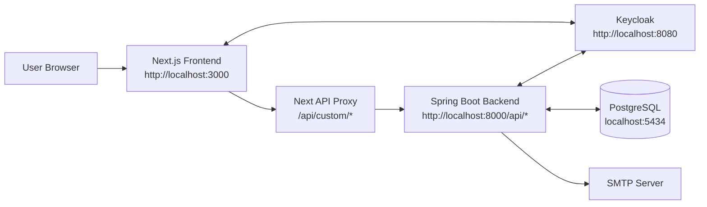
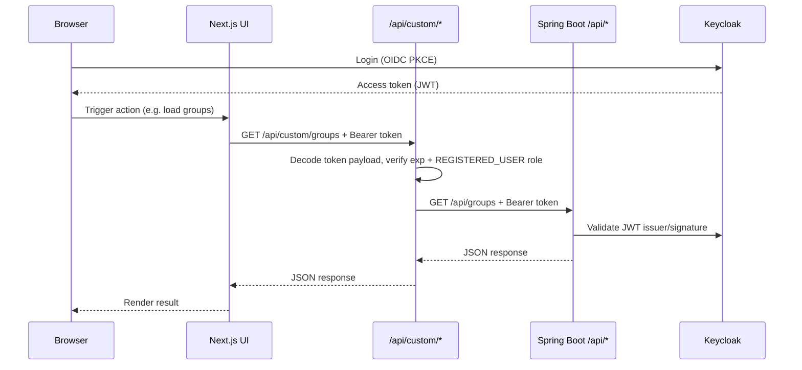
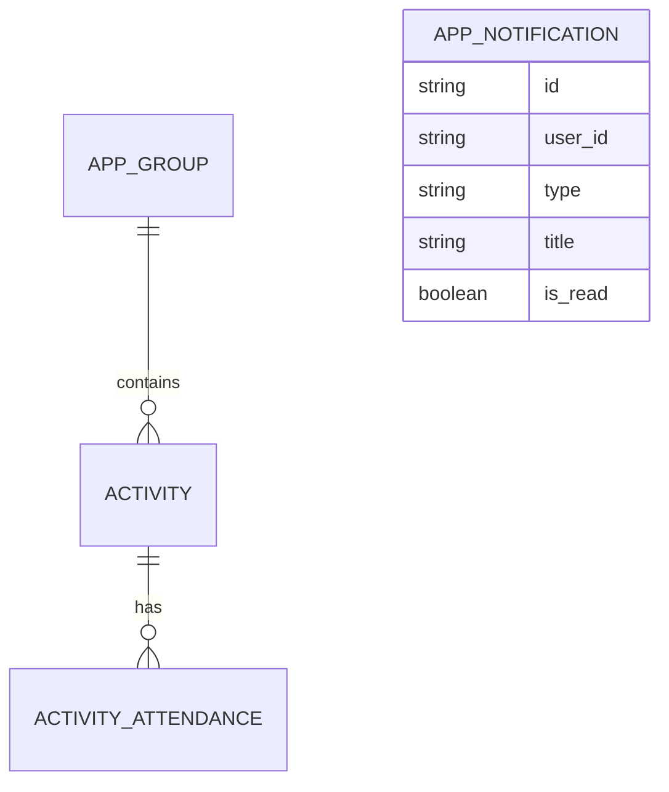

# Drumdibum Frontend

Frontend application for Drumdibum, built with Next.js 16 (App Router), React 19, and Keycloak authentication.  
Backend traffic is routed through the local proxy endpoint `/api/custom/*`.

This README focuses on operability: usage, configuration, verification, and maintenance across frontend and backend.

## Quick Start (Full Local Development)

1. Start dependencies from repository root (`../` from this folder):

```bash
cd ..
docker compose up -d
```

2. Start backend API in a separate terminal (`http://localhost:8000`):

```bash
cd backend
./mvnw spring-boot:run
```

3. Install frontend dependencies:

```bash
cd frontend-app
npm install
```

4. Create `.env.local` in this folder:

```bash
NEXT_PUBLIC_KEYCLOAK_URL=http://localhost:8080
NEXT_PUBLIC_KEYCLOAK_REALM=drumdibum
NEXT_PUBLIC_KEYCLOAK_CLIENT_ID=drumdibum-frontend
NEXT_PUBLIC_BACKEND_URL=http://localhost:8000
```

5. Start the frontend:

```bash
npm run dev
```

6. Open <http://localhost:3000>.

## Docker Services (Repository Root)

Docker services are defined in `../docker-compose.yml` and use variables from `../.env`.

| Service | Purpose | Host Port | Health / Expected State |
| --- | --- | --- | --- |
| `postgres` | Persistent database for Keycloak data | `5434` -> `5432` | `healthy` |
| `keycloak` | Identity provider and OIDC issuer | `8080` -> `8080` | `healthy` (`/health/ready`) |
| `keycloak-config-cli` | Imports realm/client config from `../keycloak/drumdibum-realm.yml` | n/a | usually `exited (0)` after successful import |

Notes:
- `postgres_data` named volume persists DB data between restarts.
- `keycloak-config-cli` is a one-shot initialization job, not a long-running service.
- Backend (`../backend`) and frontend (`frontend-app`) run outside Docker by default in this setup.

Useful commands:

```bash
cd ..
docker compose up -d
docker compose ps
docker compose logs -f keycloak
docker compose logs -f keycloak-config-cli
docker compose restart keycloak
docker compose down
```

Reset local identity/database state (destructive):

```bash
cd ..
docker compose down -v
docker compose up -d
```

## Runtime Architecture

- Browser renders Next.js pages.
- Authentication is handled client-side via Keycloak (OIDC + PKCE).
- Frontend API modules call `/api/custom/*`.
- `src/app/api/custom/[...path]/route.ts` decodes token payload, checks expiration and `REGISTERED_USER` role, and forwards requests to backend `/api/*`.
- Backend validates JWT signatures/issuer via Spring Security resource server before serving `/api/*`.





## Prerequisites

- Node.js 20+ (Node.js 22 is also used in CI)
- npm 10+
- Java 25 (if running backend locally)
- Running backend service (default: `http://localhost:8000`)
- Running Keycloak realm (default: `http://localhost:8080/realms/drumdibum`)

## Configuration

### Frontend Environment Variables

| Variable | Scope | Default | Required | Purpose |
| --- | --- | --- | --- | --- |
| `NEXT_PUBLIC_KEYCLOAK_URL` | browser/server | `http://localhost:8080` | yes | Keycloak base URL for frontend login |
| `NEXT_PUBLIC_KEYCLOAK_REALM` | browser/server | `drumdibum` | yes | Keycloak realm used by the frontend |
| `NEXT_PUBLIC_KEYCLOAK_CLIENT_ID` | browser/server | `drumdibum-frontend` | yes | Keycloak client ID for the SPA |
| `BACKEND_URL` | server only | unset | recommended in non-local envs | Backend base URL used by proxy route |
| `NEXT_PUBLIC_BACKEND_URL` | browser/server | `http://localhost:8000` fallback | yes (if `BACKEND_URL` not set) | Backend URL fallback for local/dev |

Notes:
- If both `BACKEND_URL` and `NEXT_PUBLIC_BACKEND_URL` are set, `BACKEND_URL` takes precedence.
- Trailing slashes are normalized automatically.
- Proxy requests require realm role `REGISTERED_USER`; otherwise `/api/custom/*` returns `403`.

### Backend Variables Relevant for Frontend Integration

The backend reads these from `../backend/src/main/resources/application.yaml` (or environment overrides).

| Variable | Default | Purpose |
| --- | --- | --- |
| `FRONTEND_BASE_URL` | `http://localhost:3000` | Builds links for invite and notification emails |
| `KEYCLOAK_BASE_URL` | `http://localhost:8080` | Keycloak admin API base URL |
| `KEYCLOAK_REALM` | `drumdibum` | Shared realm for backend token validation/admin operations |
| `KEYCLOAK_CLIENT_ID` | `drumdibum-backend` | Backend client for Keycloak admin access |
| `KEYCLOAK_CLIENT_SECRET` | local default exists in `application.yaml` | Backend client secret (override in environment for deployments) |
| `KEYCLOAK_ISSUER_URI` | `http://localhost:8080/realms/drumdibum` | JWT issuer for resource server validation |
| `DB_URL` | `jdbc:postgresql://localhost:5434/keycloak` | Backend database connection |
| `DB_USERNAME` | `keycloak` | Database username |
| `DB_PASSWORD` | `keycloak` | Database password |
| `SMTP_SERVER_URL` / `SMTP_SERVER_PORT` | `mail.iks-gmbh.com` / `465` | SMTP host for outgoing emails |
| `SMTP_USER` / `SMTP_USER_PASSWORD` | configured in environment | SMTP credentials |
| `NO_REPLY_MAIL` | `no-reply@iks-gmbh.com` | Sender address for emails |

### Keycloak Expectations

The repository root contains a realm bootstrap file at `../keycloak/drumdibum-realm.yml`.  
For local usage, ensure the client configuration includes:

- Realm: `drumdibum`
- Frontend client: `drumdibum-frontend`
- Backend client: `drumdibum-backend`
- Frontend redirect URI: `http://localhost:3000/*`

## Backend Integration Details

Backend implementation is in `../backend` (Spring Boot 4, Spring Security, JPA, Flyway, PostgreSQL, Keycloak Admin API, SMTP mail).

### Data Ownership

- Group membership and users are managed in Keycloak.
- Application metadata is stored in PostgreSQL:
  - `app_group` (group metadata, owner, description)
  - `activity`
  - `activity_attendance`
  - `app_notification`
- `app_group.id` matches the Keycloak group ID.



### API Surface Used by Frontend

Frontend calls `/api/custom/*`, which forwards to backend `/api/*`.

| Frontend route | Backend route | Purpose |
| --- | --- | --- |
| `GET /api/custom/groups` | `GET /api/groups` | List all groups |
| `GET /api/custom/groups/my` | `GET /api/groups/my` | List groups of current user |
| `GET /api/custom/groups/{groupId}` | `GET /api/groups/{groupId}` | Get one group |
| `POST /api/custom/groups` | `POST /api/groups` | Create group |
| `PUT /api/custom/groups/{groupId}` | `PUT /api/groups/{groupId}` | Update group |
| `DELETE /api/custom/groups/{groupId}` | `DELETE /api/groups/{groupId}` | Delete group |
| `GET /api/custom/groups/{groupId}/members` | `GET /api/groups/{groupId}/members` | List members |
| `POST /api/custom/groups/{groupId}/members` | `POST /api/groups/{groupId}/members` | Add member (`userId` or `email`) |
| `DELETE /api/custom/groups/{groupId}/members/{userId}` | `DELETE /api/groups/{groupId}/members/{userId}` | Remove member |
| `DELETE /api/custom/groups/{groupId}/members/me` | `DELETE /api/groups/{groupId}/members/me` | Leave group |
| `GET /api/custom/groups/{groupId}/activities` | `GET /api/groups/{groupId}/activities` | List activities |
| `GET /api/custom/groups/{groupId}/activities/{activityId}` | `GET /api/groups/{groupId}/activities/{activityId}` | Get one activity |
| `POST /api/custom/groups/{groupId}/activities` | `POST /api/groups/{groupId}/activities` | Create activity |
| `PUT /api/custom/groups/{groupId}/activities/{activityId}` | `PUT /api/groups/{groupId}/activities/{activityId}` | Update activity |
| `DELETE /api/custom/groups/{groupId}/activities/{activityId}` | `DELETE /api/groups/{groupId}/activities/{activityId}` | Delete activity |
| `PUT /api/custom/groups/{groupId}/activities/{activityId}/attendance` | `PUT /api/groups/{groupId}/activities/{activityId}/attendance` | RSVP |
| `GET /api/custom/groups/{groupId}/activities/{activityId}/attendance` | `GET /api/groups/{groupId}/activities/{activityId}/attendance` | List attendance |
| `GET /api/custom/users?query=...` | `GET /api/users?query=...` | Search users |
| `GET /api/custom/users/me/notifications` | `GET /api/users/me/notifications` | Get unread notifications |
| `GET /api/custom/users/me/activities` | `GET /api/users/me/activities` | Get accepted activities |
| `PUT /api/custom/users/me` | `PUT /api/users/me` | Update own profile |
| `DELETE /api/custom/users/me` | `DELETE /api/users/me` | Delete own account |

Authorization model:
- Backend requires `ROLE_REGISTERED_USER` for `/api/**`.
- Group and activity mutations enforce ownership checks server-side.
- Invitations by email create a Keycloak user and trigger required-actions email if no account exists yet.

## Usage

Main flows available in the UI:

- Login/logout through Keycloak
- Group management (create, edit, members, invitations)
- Activity management (create, edit, attendance responses)
- User profile updates
- Notification dropdown
- Locale switch (`en` / `de`)

## Commands

### Frontend Commands

| Command | Purpose |
| --- | --- |
| `npm run dev` | Start development server |
| `npm run build` | Create production build |
| `npm run start` | Run production build locally |
| `npm run lint` | Run ESLint checks |
| `npm run test` | Run Vitest in watch mode |
| `npm run test:run` | Run Vitest once |
| `npm run test:coverage` | Run tests with coverage report and enforce coverage thresholds |
| `npm run deps:audit` | Run npm vulnerability audit (`low` and above) |
| `npm run deps:outdated` | List outdated dependencies |
| `npm run deps:check` | Run both dependency checks |

### Backend Commands (`../backend`)

| Command | Purpose |
| --- | --- |
| `./mvnw spring-boot:run` | Start backend locally |
| `./mvnw -B -ntp test` | Run backend tests |
| `./mvnw -B -ntp verify` | Run backend tests with JaCoCo coverage gate |
| `./mvnw -B -ntp checkstyle:check` | Run backend lint/static style checks |
| `./mvnw -B -ntp dependency:analyze -DfailOnWarning=true` | Dependency hygiene check |
| `./mvnw -B -ntp spotbugs:check` | Security/static analysis |

## Operability and Maintenance

### Recommended Pre-Merge Checks

```bash
npm run lint
npm run test:run
npm run test:coverage
npm run deps:check
```

For backend-related changes, also run:

```bash
cd ../backend
./mvnw -B -ntp checkstyle:check
./mvnw -B -ntp verify
./mvnw -B -ntp spotbugs:check
```

### Test Coverage Gate

- Coverage is measured via Vitest (`@vitest/coverage-v8`).
- The coverage gate focuses on critical frontend runtime code:
  - `src/lib/**/*.{ts,tsx}`
  - `src/app/api/**/*.{ts,tsx}`
- Global minimum thresholds:
  - Statements: `85%`
  - Branches: `85%`
  - Functions: `85%`
  - Lines: `85%`
- Backend Maven gate (`./mvnw -B -ntp verify`) enforces JaCoCo minimums:
  - Line coverage ratio: `70%`
  - Branch coverage ratio: `55%`

### Weekly Maintenance

- Review dependency update PRs from Dependabot (`../.github/dependabot.yml`).
- Review scheduled dependency hygiene workflow results (`../.github/workflows/dependency-hygiene.yml`).
- Check test coverage trends and threshold compliance via `npm run test:coverage`.
- Verify Keycloak realm/client settings still match local and deployed redirect URLs.

### Change-Safe Areas to Verify

- Auth changes: verify login, logout, token refresh, and redirect behavior.
- Proxy changes: verify `/api/custom/*` auth checks (`401`, `403`) and backend forwarding.
- Translation changes: update both `messages/en.json` and `messages/de.json`.
- API contract changes: update `src/lib/*-api.ts` and corresponding tests.
- Backend domain changes: confirm Flyway migration + service + controller + frontend API updates stay aligned.

## Troubleshooting

### `401 Unauthorized` from `/api/custom/*`

- User is not logged in, token is malformed, or token is expired.
- Re-authenticate via UI and retry.

### `403 Forbidden. Missing required role REGISTERED_USER.`

- Logged-in user lacks the required Keycloak realm role.
- Assign role in Keycloak and log in again.

### `502 Unable to reach backend service.`

- Backend is down or `BACKEND_URL` / `NEXT_PUBLIC_BACKEND_URL` is incorrect.
- Verify backend is running on `http://localhost:8000` and check env values.

### Backend starts but API calls still fail with `403`

- Backend requires `ROLE_REGISTERED_USER` and enforces owner-only operations for editing/deleting groups and activities.
- Verify role assignment and resource ownership.

### Invite by email fails

- Backend rejects invite-by-email if the email already exists in Keycloak.
- Use member search/add by `userId` for existing users.
- Verify SMTP and Keycloak admin settings in backend config.

### Backend fails at startup (DB / Flyway / Keycloak)

- Ensure Docker services are up (`postgres` on `5434`, `keycloak` on `8080`).
- Check backend variables: `DB_URL`, `KEYCLOAK_BASE_URL`, `KEYCLOAK_ISSUER_URI`, client credentials.

### Docker services are unhealthy or realm import did not apply

- Run `docker compose ps` in repository root and verify `postgres` and `keycloak` are `healthy`.
- Check logs with `docker compose logs keycloak` and `docker compose logs keycloak-config-cli`.
- If initialization is broken, restart with `docker compose down -v && docker compose up -d` and then restart backend.

### Login flow does not complete

- Confirm Keycloak URL/realm/client ID values.
- Confirm redirect URI includes `http://localhost:3000/*`.

## Repository Layout (Frontend)

```text
frontend-app/
  src/app/                   # Next.js routes/pages and API proxy route
  src/lib/                   # auth, API clients, locale and helper logic
  src/components/            # UI components (including navbar)
  src/test/                  # test setup
  messages/                  # i18n message catalogs (en/de)
  scripts/                   # maintenance scripts
```

Related backend module:

```text
../backend/
  src/main/java/com/iks/backend/   # controllers, services, security, keycloak/email integration
  src/main/resources/application.yaml
  src/main/resources/db/migration/ # Flyway migrations
```

## Security

- Security policy and reporting process: [SECURITY.md](./SECURITY.md)
- Access tokens are kept in memory (not persisted to local/session storage)
- Redirect URIs are sanitized before Keycloak redirects
